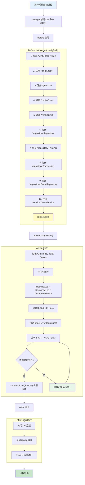
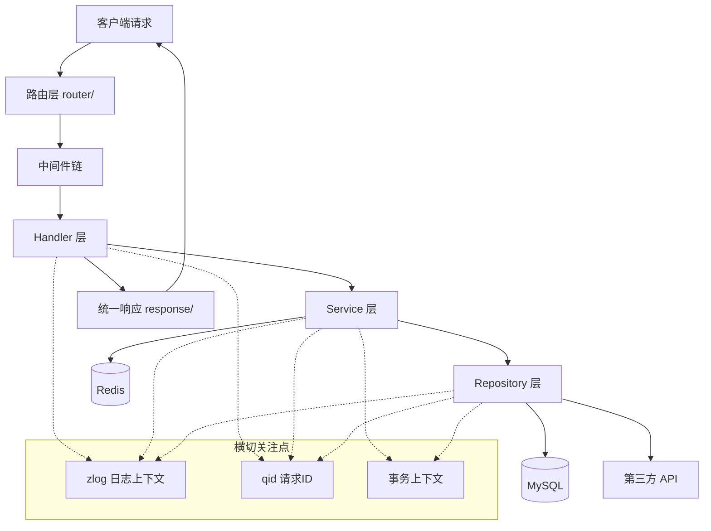
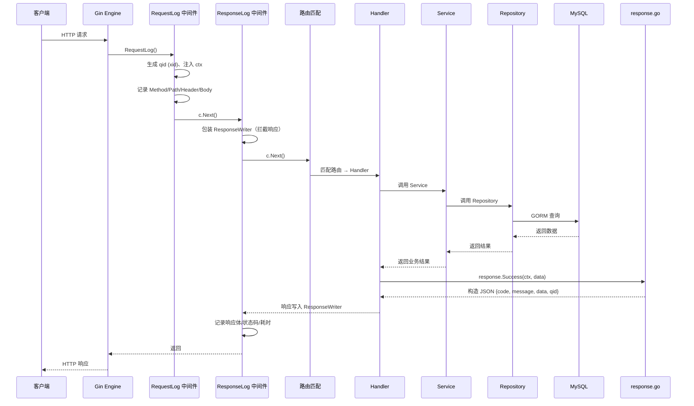
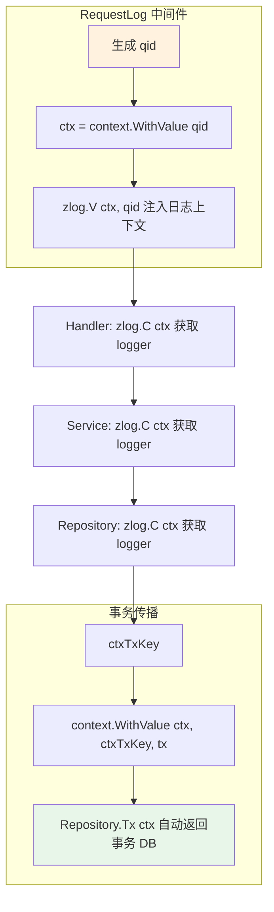
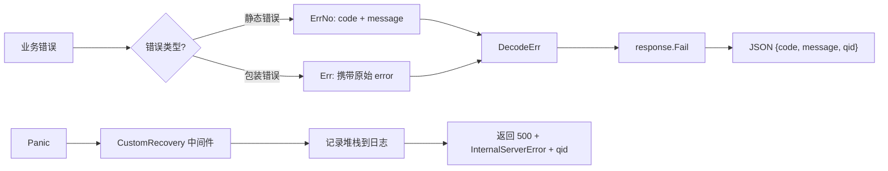
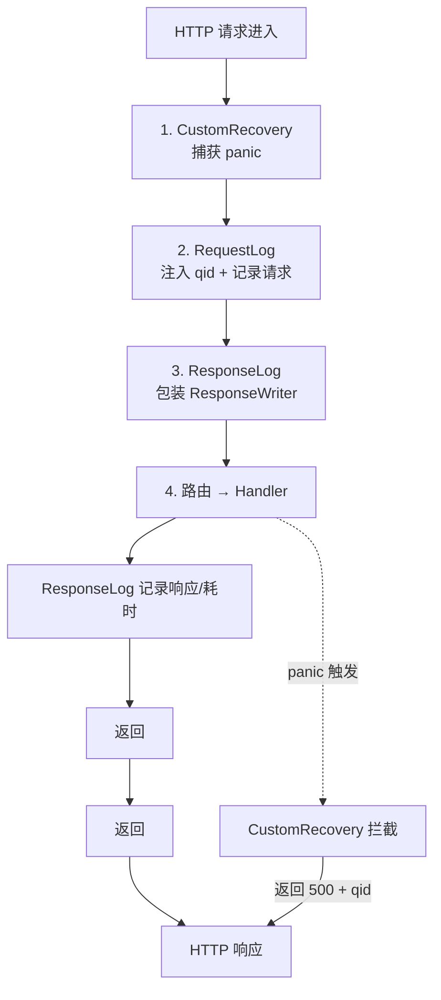
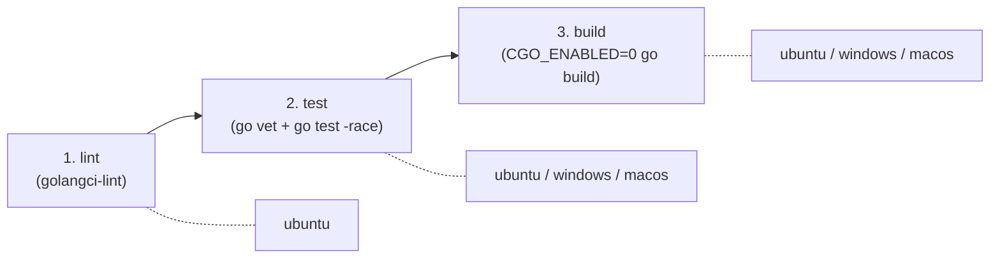

# Code Wiki — go_template

## 项目概述

`go_template` 是一个 **Go REST API 模板项目**，提供标准化的后端服务骨架。采用分层架构，内置依赖注入、结构化日志、事务管理、请求追踪、优雅关闭等生产级特性，适合作为新 Go 服务的起点。

| 属性 | 值 |
|------|-----|
| 语言 | Go 1.26 |
| HTTP 框架 | Gin v1.12 |
| ORM | GORM (MySQL) |
| 缓存 | go-redis v9 |
| 依赖注入 | samber/do v2 |
| 配置管理 | spf13/viper |
| 日志 | zap + lumberjack (轮转) |
| CLI | urfave/cli v3 |

---

## 1. 应用启动全流程



### 1.1 启动流程详解

#### 步骤 1 — 入口

```bash
go run ./cmd/go_template/ start
go run ./cmd/go_template/ start --config config/go_template.yaml
```

[main.go](file:///Users/lelesky/works/irainprojects/batchAuth/cmd/go_template/main.go) 创建 CLI 命令并启动。

#### 步骤 2 — 生命周期钩子

[app.go](file:///Users/lelesky/works/irainprojects/batchAuth/internal/command/app.go) 中 `AppCommand` 定义三个生命周期钩子：

| 钩子 | 阶段 | 操作 |
|------|------|------|
| `Before` | 启动前 | 初始化 DI 容器、加载配置 |
| `Action` | 运行时 | 启动 HTTP 服务器 |
| `After` | 关闭后 | 关闭 DB 连接、关闭 Redis、Sync 日志缓冲区 |

#### 步骤 3 — 优雅关闭

[run.go](file:///Users/lelesky/works/irainprojects/batchAuth/internal/command/run.go)：

1. 监听 `SIGINT` / `SIGTERM` 系统信号
2. 收到信号后调用 `srv.Shutdown(ctx)` 带超时优雅关闭
3. Gin `http.Server` 支持排空正在处理的请求

---

## 2. 目录结构

```
.
├── .github/workflows/go.yml          # CI/CD 流水线
├── api/v1/demo.go                    # 请求/响应 DTO 定义
├── cmd/go_template/main.go           # 应用入口
├── config/go_template.yaml           # 应用配置文件
├── doc/
│   ├── README.md
│   └── sql/demo.sql                  # 示例 DDL
├── internal/
│   ├── command/                      # CLI 应用生命周期管理
│   │   ├── app.go                    # 命令定义 (Before/Action/After)
│   │   ├── injector.go               # DI 容器注册
│   │   └── run.go                    # HTTP 服务器启动与优雅关闭
│   ├── config/config.go              # 配置结构定义与加载
│   ├── constant/constant.go          # 全局常量
│   ├── handler/demo_handler.go       # HTTP 处理器（控制器）
│   ├── middleware/
│   │   ├── custom_recovery.go        # 自定义 panic 恢复
│   │   └── request_log.go           # 请求/响应日志
│   ├── model/demo_model.go           # GORM 数据模型
│   ├── pkg/                          # 公共工具包
│   │   ├── errno/                    # 错误码与自定义错误
│   │   ├── help/                     # 通用工具函数
│   │   ├── httpc/                    # HTTP 客户端封装
│   │   ├── response/                 # 统一 API 响应
│   │   ├── zapgorm/                  # GORM 日志适配 zap
│   │   └── zlog/                     # 结构化日志封装
│   ├── repository/                   # 数据访问层
│   │   ├── demo_repo.go
│   │   └── repository.go            # 通用 Repository + 事务
│   ├── router/                       # 路由注册
│   │   ├── demo.go
│   │   └── router.go
│   ├── service/demo_service.go       # 业务逻辑层
│   └── store/                        # 连接管理
│       ├── db.go                     # MySQL (GORM)
│       └── redis.go                  # Redis
├── scripts/replace.go                # 项目重命名脚本
├── Dockerfile
├── Makefile
├── .golangci.yaml
├── go.mod
└── go.sum
```

---

## 3. 分层架构

### 3.1 数据流向图



### 3.2 各层职责

| 层 | 职责 | 示例 |
|----|------|------|
| **api** | 定义请求/响应 DTO | `AddAuthRequest`、`AddAuthResponse` |
| **handler** | 解析请求参数、调用 service、返回统一响应 | `DemoHandler.Health()` |
| **service** | 核心业务逻辑、事务编排、调用 repository | `DemoService.Create()` |
| **repository** | 封装 GORM 查询、第三方 HTTP 调用 | `DemoRepository.GetByParkCode()` |
| **model** | GORM 数据模型，映射数据库表 | `Demo` → `demos` 表 |
| **router** | 将 URL 路径绑定到 handler | `GET /` → `DemoHandler.Health` |

---

## 4. 依赖注入 (DI)

### 4.1 DI 初始化流程

```mermaid
flowchart LR
    A[config.LoadConfig] --> B[do.ProvideValue: Config]
    B --> C[do.Provide: zlog.NewZapLog]
    C --> D[do.Provide: store.NewDB]
    D --> E[do.Provide: store.NewRedis]
    E --> F[do.Provide: httpc.NewClient]
    F --> G[do.Provide: repository.NewRepository]
    G --> H[do.Provide: repository.NewThirdApi]
    H --> I[do.Provide: repository.NewTransaction]
    I --> J[do.Provide: repository.NewDemoRepository]
    J --> K[do.Provide: service.NewDemoService]
    K --> L[DI 容器就绪 cmd.di]

    style A fill:#e1f5fe
    style L fill:#c8e6c9
```



项目使用 `samber/do/v2` 管理所有组件依赖，注册顺序保证依赖方一定在被依赖方之后初始化。

### 4.2 组件注册顺序

| 序号 | 组件 | 类型 | 说明 |
|------|------|------|------|
| 1 | `config.Config` | 值注入 | 全局配置 |
| 2 | `*zlog.Logger` | 构造函数 | 结构化日志 |
| 3 | `*gorm.DB` | 构造函数 | MySQL 连接 |
| 4 | `*redis.Client` | 构造函数 | Redis 连接 |
| 5 | `*resty.Client` | 构造函数 | HTTP 客户端 |
| 6 | `*repository.Repository` | 构造函数 | 数据访问基类 |
| 7 | `*repository.ThirdApi` | 构造函数 | 第三方 API 基类 |
| 8 | `repository.Transaction` | 接口注入 | 事务管理 |
| 9 | `*repository.DemoRepository` | 构造函数 | Demo 数据访问 |
| 10 | `*service.DemoService` | 构造函数 | 业务逻辑 |

### 4.3 Handler 为何不用 DI？

Handler 不在 DI 容器中注册，而是在路由初始化时通过**构造函数注入**手动组装：

```go
// router/demo.go
func InitDemoRouter(r *gin.Engine, i do.Injector) {
    demoService := do.MustInvoke[*service.DemoService](i)
    d := handler.NewDemoHandler(demoService)
    r.GET("/", d.Health)
}
```

原因：

- Handler 仅被路由层使用一次，不具备全局复用性
- 避免 DI 容器随业务增长过度膨胀
- 路由天然知道 Handler 需要哪些依赖，当场解析最直接
- 测试友好，无需构建完整 DI 容器即可 mock

---

## 5. HTTP 请求全生命周期



---

## 6. 请求追踪与上下文传播



### 6.1 日志上下文

```go
// 注入上下文字段
zlog.V(ctx, "user_id", "123", "action", "login")

// 后续在 handler → service → repository 全链路获取
logger := zlog.C(ctx)
logger.Info("processing")  // 自动携带 user_id=123, action=login
```

### 6.2 事务上下文

```go
err := repo.Transaction(ctx, func(txCtx context.Context) error {
    // txCtx 内调用 repo.Tx(txCtx) 自动使用事务连接
    repo.DemoRepository.Delete(txCtx, id)
    return nil
})
```

---

## 7. 统一 API 响应

[response/response.go](file:///Users/lelesky/works/irainprojects/batchAuth/internal/pkg/response/response.go) 提供统一的 JSON 响应格式：

```json
{
    "code": 0,
    "message": "ok",
    "data": {},
    "qid": "cq2vmgjk7h1je0n2pcq0"
}
```

### 响应方法

| 方法 | 用途 | code |
|------|------|------|
| `response.Success(ctx, data)` | 成功响应 | 0 |
| `response.SuccessMsg(ctx, msg)` | 成功响应（仅消息） | 0 |
| `response.Fail(ctx, err)` | 业务失败 | 根据 err 类型 |
| `response.ValidatorErr(ctx, msg)` | 参数校验失败 | 400 |

---

## 8. 错误处理体系

### 8.1 错误流程



### 8.2 错误码

[errno/code.go](file:///Users/lelesky/works/irainprojects/batchAuth/internal/pkg/errno/code.go)：

| 错误码 | 常量 | 含义 |
|--------|------|------|
| `0` | `Ok` | 成功 |
| `500` | `InternalServerError` | 服务器内部错误 |

### 8.3 自定义错误类型

- `ErrNo` — 静态错误码（仅 code + message），对应预定义的业务错误
- `Err` — 包装原始 error，携带底层 error 信息用于日志排查
- `DecodeErr(err)` — 统一解码为 HTTP 状态码

---

## 9. 中间件执行链



### 9.1 RequestLog / ResponseLog

[request_log.go](file:///Users/lelesky/works/irainprojects/batchAuth/internal/middleware/request_log.go)：

- `RequestLog()` — 注入唯一 `qid`（xid 生成），记录请求方法、路径、Header、Body
- `ResponseLog()` — 包装 `gin.ResponseWriter`，拦截响应体，记录状态码、响应体、耗时

### 9.2 CustomRecovery

[custom_recovery.go](file:///Users/lelesky/works/irainprojects/batchAuth/internal/middleware/custom_recovery.go)：

- 捕获 handler 中的 panic，避免进程崩溃
- 记录 panic 信息和堆栈到日志
- 返回 500 + `InternalServerError` + qid

---

## 10. 配置管理

[config/config.go](file:///Users/lelesky/works/irainprojects/batchAuth/internal/config/config.go) 定义配置结构，使用 `viper` 加载 YAML：

```yaml
# config/go_template.yaml
server:
  port: 8073
  mode: debug          # debug | release

db:
  host: localhost
  port: 3306
  user: root
  password: ""
  name: demo
  maxIdleConns: 10
  maxOpenConns: 30

redis:
  host: localhost
  port: 6379
  password: ""
  db: 0

log:
  level: debug
  encoding: console    # console | json
  output: console      # file | console | both
  logFile: logs/app.log
  maxSize: 100         # MB
  maxBackups: 30
  maxAge: 7            # 天
```

配置加载后通过 `validator` 进行结构体校验。

---

## 11. 日志系统

### 11.1 zlog — 结构化日志

[zlog/zlog.go](file:///Users/lelesky/works/irainprojects/batchAuth/internal/pkg/zlog/zlog.go)：

- 基于 `zap`，支持 Console 和 JSON 两种编码
- 三种输出模式：`console`、`file`、`both`
- 文件轮转由 `lumberjack` 处理（按大小/天数切分）
- 支持上下文日志传播（`V` / `C`）

### 11.2 zapgorm — GORM 日志适配

[zapgorm/zapgorm.go](file:///Users/lelesky/works/irainprojects/batchAuth/internal/pkg/zapgorm/zapgorm.go)：

- 将 GORM SQL 日志桥接到 zap
- 慢查询检测阈值：100ms
- 慢查询记录调用栈，便于定位问题 SQL

---

## 12. 数据访问层

### 12.1 Repository 模式

[repository/repository.go](file:///Users/lelesky/works/irainprojects/batchAuth/internal/repository/repository.go) 提供通用数据访问基类：

| 组件 | 持有资源 | 用途 |
|------|---------|------|
| `Repository` | `*gorm.DB` + `*zlog.Logger` | 数据库操作基类 |
| `ThirdApi` | `*resty.Client` + `*config.Config` | 第三方 API 调用基类 |
| `Transaction` | 接口 | 事务管理 |

### 12.2 事务管理

```go
// 上下文感知的 DB 获取
func (r *Repository) Tx(ctx context.Context) *gorm.DB {
    if tx, ok := ctx.Value(ctxTxKey).(*gorm.DB); ok {
        return tx  // 返回事务 DB
    }
    return r.db  // 返回普通 DB
}

// 事务包装器
func (r *Repository) Transaction(ctx context.Context, fn func(context.Context) error) error {
    return r.db.Transaction(func(tx *gorm.DB) error {
        txCtx := context.WithValue(ctx, ctxTxKey, tx)
        return fn(txCtx)
    })
}
```

### 12.3 HTTP 客户端

[httpc/httpc.go](file:///Users/lelesky/works/irainprojects/batchAuth/internal/pkg/httpc/httpc.go)：

- 基于 `resty` 封装
- 注册 `OnBeforeRequest` / `OnAfterResponse` 钩子自动记录请求/响应日志
- 日志中自动携带 `qid` 进行链路追踪

---

## 13. 数据模型

[model/demo_model.go](file:///Users/lelesky/works/irainprojects/batchAuth/internal/model/demo_model.go)：

```go
type Demo struct {
    ID       uint      `gorm:"primaryKey"`
    ParkCode string    `gorm:"column:park_code"`
    Name     string
    CreatedAt time.Time
    UpdatedAt time.Time
    DeletedAt gorm.DeletedAt `gorm:"index"`
}
```

模型支持 `ScopeName` 查询作用域，用于封装常用查询条件。

---

## 14. 调试端点

在 debug 模式下，可通过以下端点查看 DI 容器状态：

| 端点 | 功能 |
|------|------|
| `GET /debug/do` | DI 索引页 |
| `GET /debug/do/scope/:scopeId` | 查看指定 scope |
| `GET /debug/do/service` | 查看已注册的 service 列表 |

---

## 15. 项目重命名

```bash
go run scripts/replace.go -o go_template -n 新项目名
```

[scripts/replace.go](file:///Users/lelesky/works/irainprojects/batchAuth/scripts/replace.go) 自动：

1. 替换所有 import 路径中的 `go_template`
2. 更新 `go.mod` 模块名
3. 更新 `Makefile` / `Dockerfile` 中的引用
4. 重命名 `config/go_template.yaml` 和 `cmd/go_template/` 目录
5. 执行 `go mod tidy` + 编译验证
6. 失败自动 `git checkout .` 回滚

---

## 16. CI/CD

[go.yml](file:///Users/lelesky/works/irainprojects/batchAuth/.github/workflows/go.yml) 定义 GitHub Actions 流水线：



---

## 17. 常用命令速查

```bash
# 编译
make build

# 运行
make run

# 指定配置文件运行
go run ./cmd/go_template/ start --config config/go_template.yaml

# 代码检查
make lint

# 运行测试
go test ./... -count=1 -race -coverprofile=coverage.out

# Docker 构建 (ARM64)
make docker-build

# Docker 运行
make docker-run

# 项目重命名
go run scripts/replace.go -o go_template -n 新项目名
```

---

## 18. 关键设计模式

| 模式 | 实现位置 | 说明 |
|------|---------|------|
| **依赖注入** | `internal/command/injector.go` | samber/do 集中管理组件生命周期 |
| **仓库模式** | `internal/repository/` | 封装数据访问逻辑，支持事务自动传播 |
| **中间件链** | `internal/middleware/` | 请求日志 → 响应日志 → 异常恢复 |
| **统一响应** | `internal/pkg/response/` | 所有 API 返回统一 JSON 结构 |
| **上下文传播** | `internal/pkg/zlog/` | qid + 日志字段贯穿全链路 |
| **优雅关闭** | `internal/command/run.go` | 信号监听 + 超时 Shutdown + 资源清理 |
| **模板模式** | `internal/repository/repository.go` | Repository 基类提供 `Tx()` 和 `Transaction()` |


## 19. 作者
- Email:
  - kinyou_xy@foxmail.com
- Wechat:
  - xingmaogou
